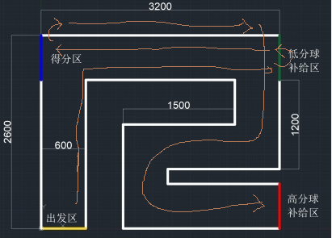
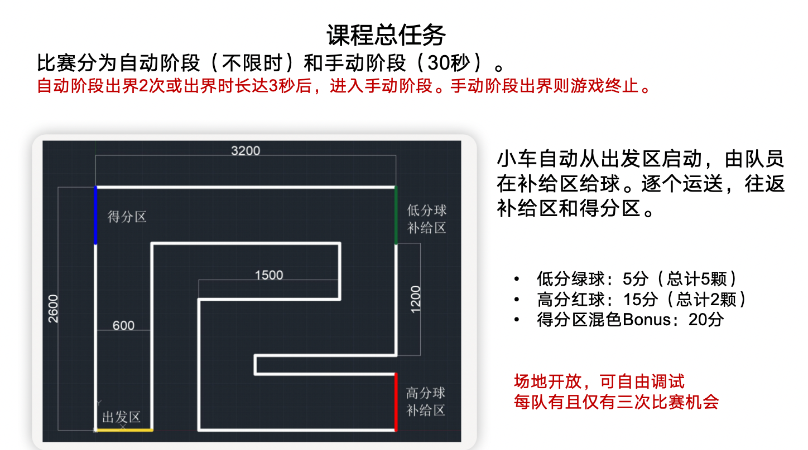

# VEX Group Project

## Project Introduction

Created by [LYBQinc](https://github.com/LYBQinc), [gaohaochen](https://github.com/gaohaochen), [I-AM-A-NOOB](https://github.com/I-AM-A-NOOB)

This project was created in the summer camp of SJTU and just for memory. The headers and the framework of the project are from teachers in SJTU, so I won't open its source code.

## Project Target

The project is to design a path planning algorithm for a robot that starts from the yellow line, fetches the ball and drops it at the blue line.

|task|describtion|
|:---:|:---:|
|Fetch a green ball|get 5 points|
|Fetch a red ball|get 15 points|
|Fetch one red ball and one green ball|get extra 20 points' bonus|

1. autonomous part
  No time limit, no human intervention, just let the robot fetch the ball according to the code you have already written.

2. user control part
  Time limit in 30s, human intervention, you can control the robot to fetch the ball and drop it on the blue line.

## Robot

The robot is a VEX robot, which is a small robot that can be controlled by a controller. It has a motor, a sensor, and a camera. The motor can rotate, and the sensor can detect the color of the ball. The camera can detect the position of the ball.
the 3D model of the robot is at [Here](https://github.com/I-AM-A-NOOB/VEX-Group-Project/tree/main/resources/KiwiDrive_rev2.exe).

## Feelings

Useful for learning about robotics. Although the headers and framework are provided by the teachers, the project is still challenging. We also learnt a bit about C++ object oriented programming. Thanks for Visual Studio Live Share, which allows us to work like a professional team in real time.

Thanks so much for the teachers and my teammates, [LYBQinc](https://github.com/LYBQinc) and [gaohaochen](https://github.com/gaohaochen), who did most of the coding and debugging.

## Build

Unzip the files in the zip to the directory where the zip is located, then open Visual Studio Code in the root directory of the project, then open main.cpp and compile it. The password is the final score
